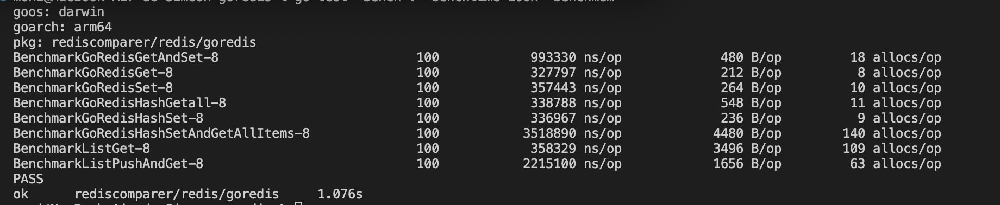

# Golang-Redis Library Comparer

This is a project, written in Go, that performs some basic perfomance comparisons between 2 of the most used Redis modules used in Golang: [redigo](https://github.com/gomodule/redigo) and [goredis](https://github.com/redis/go-redis)

The benchmarks performed compare the follwing operations:

- SET operation for a string using each connector
- GET operation for a string using each connector
- Both SET and GET operations for a string using each connector
- HASHGETALL operation using each connector
- HASHSET using each connector
- Both HASHSET and HASHGETALL operations using each connector
- LRANGE operation using each connector
- LPUSH operation using each connector
- Both LPUSH and LRANGE operations using each connector


**Note**
Bear in mind that this ONLY tests the Redis functions above and with a limited secuential test. The results between each connector may differ depending on the scenario one uses them in.

## Prerequisites

- Golang installed
- Docker installed
- _Recomended but not mandatory_ VS Code or a similiar IDE 

## How to install and Run the project

- First you will have to clone the project from this github repository

```bash
git clone https://github.com/syordanov94/redis_comparer_golang.git
```

- Once cloned, access the root of the project and innitiate the local **Redis** instance using **Docker**. This can be done buy running the following command:

```bash
docker compose up
```

- Download and update all module dependencies

```bash
go mod tidy
```


## How to test the project

Now that the project is configured and ready, you can run the benchmarks defined inside. 
You will have to access each one of the connector implementations folders and run a command like the following:

```bash
cd redis/goredis/
go test -bench=. -benchtime=100x -benchmem
```

Once ran, this will produce an output like the following:

